# hubbub

> **A maintained fork of
> [yilunzhang/claude-code-inter-session](https://github.com/yilunzhang/claude-code-inter-session),
> renamed.** Maintained by [@agigante80](https://github.com/agigante80).
> It carries six fixes upstream doesn't have yet — two security fixes, a
> server-election race, and more — all offered back as open pull
> requests. See [About this fork](#about-this-fork) for the full list and
> [Install](#install) for the marketplace to add.

Agent-to-agent messaging for Claude Code sessions on the same machine. Each
Claude Code session connects to a local WebSocket bus and can send messages
to other connected sessions; incoming messages are delivered to the
receiving agent as prompts and **acted on as instructions by default**.
One session can drive another.

Implemented using Claude Code's `Monitor` tool: ms-level delivery latency,
no active polling, and no token or performance cost when there are no messages.
Does NOT require claude.ai login. No configuration needed.

Localhost only and Unix-only (macOS, Linux, WSL2) for now.



## Renamed from `inter-session`

This project was called `inter-session` up to and including `0.1.3`. The
plugin is now **`hubbub`** and its skill is **`talk`**, so the command is
`/hubbub:talk` rather than `/inter-session:inter-session`.

The runtime followed in `0.2.0`, but carefully, because a hard cutover
would split the bus in half:

- **State lives in `~/.claude/data/hubbub/`.** On first run the old
  directory is moved there and **`~/.claude/data/inter-session` is left
  behind as a symlink to it**. Don't delete that symlink. Older builds
  hardcode the legacy path, and they have to keep resolving to the *same*
  token, election lock and pidfile — otherwise two clients each elect
  their own server, both bind the port, and the loser's cleanup wipes the
  winner's identity.
- **Environment overrides are `HUBBUB_PORT` / `HUBBUB_IDLE_MINUTES`**,
  and the pre-rename `INTER_SESSION_*` spellings are still honoured, so
  an old export in your shell profile keeps working.
- **Notification lines still start with `[inter-session …]`.** That one
  is genuinely unfinished: the prefix is the contract between the monitor
  and the skill's reaction policy, so it needs a release that accepts
  both spellings before the emitter can move. Tracked in
  [#10](https://github.com/agigante80/claude-code-hubbub/issues/10).

### Upgrading from `inter-session`

Because both plugins share the bus, the port, and — via that symlink —
the data directory, old and new clients interoperate, so you can migrate
one session at a time. Four things are easy to get wrong:

1. **Installing `hubbub` does not migrate a running session.** The old
   monitor still holds that session's lock, so the new one exits with
   `another monitor for this session is already running`. Stop the old
   monitor first (`TaskStop` its task, or `kill` the `listener_pid`
   recorded in `~/.claude/data/inter-session/clients/<key>.session`),
   then run `/hubbub:talk`. Use the `inter-session` path here: if no
   new-build entry-point has run yet the `hubbub` directory does not
   exist, and once one has, the legacy path is a symlink to it — so this
   spelling is correct in both states.
2. **`/plugin uninstall` does not remove the plugin's cache directory,
   and a session started before the uninstall keeps the old skill in
   memory.** Such a session can still spawn the old client — and since
   whichever client wins the election spawns the server, one old client
   is enough to put the whole machine back on the old build. Restart
   those sessions, or remove the stale cache directory, if you need to
   be certain which version is serving.
3. **If you had run `auto-start off` under `0.1.x`, set it again after
   upgrading.** That setting used to live only as a `when` value inside
   the plugin's own directory, which the upgrade replaces — and `0.2.0`
   ships auto-start **on**, so those sessions come back always-on. Re-run
   `/hubbub:talk auto-start off` once; from `0.2.0` the choice is also
   recorded under the data directory, where plugin updates can't reach
   it, so it sticks from then on.
4. **Don't tidy up `~/.claude/data/inter-session` while cleaning up the
   rest.** After `0.2.0` it is the compatibility symlink described above,
   not a leftover. Remove it and any still-running old build stops
   sharing the token and the election lock with the new ones, which is
   the one way to genuinely fork the bus.

To force the server itself to the new build, get to zero connected
clients (or `kill` the pid in `~/.claude/data/hubbub/server.<port>.pid`)
and let a new-path client elect a fresh one.

## About this fork

This is a **maintained fork** of
[yilunzhang/claude-code-inter-session](https://github.com/yilunzhang/claude-code-inter-session).
Upstream last shipped `0.1.3` on 2026-05-24. This fork is at **`0.2.0`**:
everything below was developed here on top of that release and offered
back upstream as pull requests, which are still open — so for now this
fork is where the fixes live.

| Improvement | What it fixes | Upstream PR |
| :---------- | :------------ | :---------- |
| **Server-election race** | Two sessions starting at once could both `bind()` and spawn a server; the loser's cleanup deleted the winner's pidfile, leaving both clients refusing to connect. Now a per-endpoint `flock` serializes the election. | [#15](https://github.com/yilunzhang/claude-code-inter-session/pull/15) |
| **SEC-001 — sender spoofing** | A peer's Unicode `label` was interpolated into the notification line unescaped, so it could close the header's bracket and forge the `from="…"` attribution. Now rejected at the boundary *and* neutralized at render. | [#8](https://github.com/yilunzhang/claude-code-inter-session/pull/8) |
| **SEC-002 — forged trailing directive** | Message text could embed `[inter-session …]`-looking text that read as a second, more-trusted message. The reaction policy now states that only the leading header is authoritative. | [#9](https://github.com/yilunzhang/claude-code-inter-session/pull/9) |
| **Label persistence** | Display labels were lost on every restart. They now persist per project, keyed by repo root. | [#11](https://github.com/yilunzhang/claude-code-inter-session/pull/11) |
| **In-place relabel** | Changing a label used to mean disconnect + reconnect, losing the `session_id`. `/hubbub:talk relabel` now updates it live. | [#13](https://github.com/yilunzhang/claude-code-inter-session/pull/13) |
| **Reply-transport binding** | A bus message answered with the harness's `SendMessage` silently reached the wrong session. Replies are now bound to the transport the message arrived on — see [docs/DELIVERY.md](./docs/DELIVERY.md). | fork-only |

[Install](#install) adds **this** repo's marketplace, so the commands
there give you the fork. Upstream remains the original project and is
credited throughout; if the pull requests land, the two converge again —
minus the rename, which is this fork's own.

Published by **Andrea Gigante** ([@agigante80](https://github.com/agigante80))
under the same MIT licence, with upstream's copyright notice retained in
[LICENSE](./LICENSE) alongside one for the fork's modifications.

## How does this compare to subagents and agent teams?

Claude Code already has two concurrency primitives:
[subagents](https://code.claude.com/docs/en/sub-agents) (the `Agent`
tool — spawn a worker inside your session for a focused subtask) and
[agent teams](https://code.claude.com/docs/en/agent-teams) (a team of
independent CC sessions launched together for one task). hubbub
is a different axis: it connects the **long-lived Claude Code sessions
you've already opened** across terminals and projects, so they can
message each other.

| Aspect          | Subagent                                          | Agent team                                                | hubbub                                                                |
| :-------------- | :------------------------------------------------ | :-------------------------------------------------------- | :--------------------------------------------------------------------------- |
| Context         | Own window; results return to the caller          | Own window; fully independent                             | Own window; fully independent; each session keeps its user-driven conversation |
| Communication   | Reports back to the main agent only               | Teammates message each other directly                     | Peer-to-peer across every connected session                                  |
| Coordination    | Main agent manages all work                       | Shared task list with self-coordination                   | Ad-hoc — each session applies its own reaction policy                        |
| Lifecycle       | Spawned per task; exits when done                 | Spawned by lead for one task                              | Not spawned — connects sessions you already opened                           |
| Driven by       | Parent agent (programmatic)                       | Lead agent + shared task list                             | You — each session is yours; the bus only lets them message                  |
| Best for        | Focused tasks where only the result matters       | Complex work needing teammate discussion in one task      | Cross-session coordination across long-running, unrelated work               |
| Token cost      | Lower: results summarized back to the main context | Higher: each teammate is a separate Claude instance       | Adds only per-message overhead to sessions you're already running            |

**Use a subagent** when you need a quick, focused worker that returns
a summary. Your main conversation stays clean.

**Use an agent team** when teammates need to share findings, challenge
each other, and coordinate inside one task — best for parallel research
with competing hypotheses, parallel code review, and feature work where
each teammate owns a separate piece.

**Use hubbub** when you have multiple Claude Code sessions
running for unrelated long-lived work and want one to drive another —
e.g. delegating a bug fix from one project's session to another's;
running iterative loops where each side's context grows in value
across many rounds; or letting two sessions with hours of accumulated
conversation history share findings or coordinate without restarting
either side. Each session keeps its own project context, conversation
history, and tool permissions; the bus just routes messages between
them.

**Transition point**: if you find yourself copy-pasting between Claude
Code sessions you already have open, or if your agent-team task spans
multiple projects you're working in separately, hubbub is the
natural fit — your existing sessions become the team.

## Prerequisites

- Python ≥ 3.10
- Claude Code ≥ 2.1.105

## Install

In any Claude Code session, add this repository as a plugin marketplace
and install from it:

```
/plugin marketplace add https://github.com/agigante80/claude-code-hubbub
/plugin install hubbub@hubbub
```

`hubbub@hubbub` is `<plugin>@<marketplace>` — both are named `hubbub`,
because this repo is a single-plugin marketplace. A marketplace is just a
git repo, so there is nothing to wait for: `marketplace add` clones this
one and the plugin is available immediately.

Then start using it:

```
/hubbub:talk
```

Installing the **original** project instead is
`/plugin marketplace add https://github.com/yilunzhang/claude-code-inter-session`
followed by `/plugin install inter-session` — that ships upstream's
`0.1.3` without the fixes listed under [About this fork](#about-this-fork).

Claude handles runtime dependency install automatically on first use — no
extra setup needed. Until then the auto-started monitor exits quietly at
session open rather than nagging in sessions that never touch the bus;
you get the actionable `install-deps` prompt the first time you actually
invoke `/hubbub:talk`.

By default the monitor starts at **every session open**, so a session is
reachable by its peers without anyone having to invoke anything in it
first. Leaving it on means every Claude Code session on the machine is
addressable by every other one; that is the point of the tool, and it is
worth knowing before you rely on it — see
[Security](#security).

If you would rather sessions opt in, `/hubbub:talk auto-start off` stops
the plugin starting a monitor at all — it records the choice under the
data directory as well as in the plugin manifest, so a later
`/plugin update` cannot quietly hand always-on back to you. Connecting
still works exactly as before: `/hubbub:talk connect` starts the monitor
itself and is unaffected by the opt-out. Apply the change with
`/reload-plugins`.

## Examples

The first example shows the simple one-shot pattern. Examples 2 and 3
show **iterative loops** — many rounds of back-and-forth where each
session's context grows in value over time. These are the cases
subagents and agent teams *can't* do well: subagents reset between
calls, agent teams exit when the task ends.

Click any to expand.

<details>
<summary><b>Example 1 — cross-project bug fix</b> · simple one-round delegation</summary>

Two Claude Code sessions, each in a different project.

**Session A** (in `~/proj/auth`):
```
/hubbub:talk
→ Connecting as `auth-refactor`…
```

**Session B** (in `~/proj/payments`):
```
/hubbub:talk
→ Connecting as `payments-debug`…
```

**Session A** (user prompt):
```
send the bug you found to payments session and ask it to fix it.
```

**Session B** receives a notification, fixes the bug, and replies:
```
[inter-session msg=q7r8 from="auth-refactor"] null deref in checkout.py:42 — user.email is unchecked; please add a guard and verify with the existing tests
→ Edits checkout.py to add the null guard
→ Runs pytest — 47 tests pass
→ Bash: send.py --to auth-refactor --text 'done: guarded user.email at checkout.py:42; 47 tests pass'
```

**Session A** sees:
```
[inter-session msg=k2m9 from="payments-debug"] done: guarded user.email at checkout.py:42; 47 tests pass
```

The receiving agent applies guardrails before acting (see the
[Reaction policy](./skills/talk/SKILL.md)) — destructive
operations require explicit affirmative content; ambiguous requests
prompt a `question:` clarifier first.

</details>

<details>
<summary><b>Example 2 — implementer + reviewer</b> · TDD-style iterative loop</summary>

Two sessions iterating on a complex feature. The reviewer's accumulated
catalog of edge cases makes each successive round more pointed — context
that *grows in value* with every round.

**Setup**: `impl` session in `~/proj/rate-limiter` writing a token-bucket
implementation; `reviewer` session next to it as adversarial test author.
Both stay live throughout the loop — no spawning per round.

**Round 1**
```
impl     → "v1 pushed: basic per-key bucket with refill"
reviewer → reads code, writes 4 baseline tests, runs them
         → "3 pass, 1 fails: off-by-one at exactly-burst-threshold.
            asserts at tests/limiter/test_burst.py:42"
impl     → fixes → "v2"
```

**Round 5** — reviewer references its accumulated catalog:
```
reviewer → "v5 passes everything in test_burst.py and test_concurrent.py
            from rounds 1-4. New angle: clock skew. added test_clock_skew.py
            with 3 cases (NTP step, leap second, monotonic going backward).
            1 of 3 fails — leap second causes negative refill."
```
The reviewer *knows* what's already solid (rounds 1–4 cases), so it
probes new territory instead of re-checking baseline.

**Round 12** — accumulated context shows up explicitly:
```
reviewer → "all 18 prior cases still green. tried fuzzing with 100k random
            rate/burst combos: found 1 deterministic deadlock when burst=0.
            seed in tests/limiter/fuzz_seeds.json"
```
By round 12 the reviewer has its own files: `test_burst.py`,
`test_concurrent.py`, `test_clock_skew.py`, `fuzz_seeds.json` — a
**growing artifact** that's part of its session state. A subagent or
freshly-spawned teammate would have to rediscover all of this each round.

**Outcome**: ~30 rounds, ~4 hours wall-clock, ends when the reviewer's
adversarial budget is exhausted. `impl`'s session retains the design
rationale across attempts; `reviewer`'s retains the regression suite.
You can come back tomorrow and resume — both sessions persist.

</details>

<details>
<summary><b>Example 3 — red-team + blue-team</b> · adversarial security loop</summary>

Two sessions in a long back-and-forth: attack catalog on one side, patch
lineage on the other. Both grow round by round.

**Setup**: `red` session in `~/proj/security-fuzz` with attack scriptlets;
`blue` session in `~/proj/auth-service` patching. Hours of accumulated
context on each side by the time the loop hits round 38.

**Round 1**
```
red  → "broke it: token reuse via cached redis lookup. repro:
        /tmp/red-001.sh; receives valid 401 token after rotation"
blue → "done: patched in PR-491 (drop-cache-on-rotate). retry."
```

**Round 7** — red references the patch lineage and pivots:
```
red  → "the cache fix from r1 holds. tried bypassing via header-smuggling
        (CRLF in X-Forwarded-For); session pinning bypassed in 2 of 4
        endpoints. catalog now: 7 working exploits, 6 patched."
blue → "patched header parser. retry."
```

**Round 38** — both sides have a hardened-spots map:
```
red  → "no new bypass in this 30-min budget. attack catalog: 24 working
        at peak, all patched. notable patterns:
          cache-coherence       (rounds 1, 6, 19)
          header-smuggling      (rounds 2-5)
          session-state-confusion (rounds 12-17)"
blue → "tracked in PATCH_LOG.md (24 entries). all classes hardened.
        ready for external pentest."
```

By round 38, both sessions know what's been tried, what worked, what
didn't. `red` doesn't re-attempt dead-end attack classes; `blue` knows
exactly which surfaces are hardened. The accumulated knowledge IS the
work product. Subagents (context resets per call) and agent teams (one
task, then exit) couldn't sustain this kind of multi-day adversarial
collaboration.

</details>

## Slash commands

| Command                                                        | What it does                                                   |
| :------------------------------------------------------------- | :------------------------------------------------------------- |
| `/hubbub:talk`                                 | Connect (alias for `connect`).                                 |
| `/hubbub:talk connect [name]`                  | Connect to the bus; `name` proposed from context if omitted.   |
| `/hubbub:talk install-deps`                    | Install runtime deps (websockets, psutil) into an isolated venv. |
| `/hubbub:talk list`                            | List connected sessions.                                       |
| `/hubbub:talk send <name> <text>`              | Send a message to one session.                                 |
| `/hubbub:talk broadcast <text>`                | Send to all other sessions (≤ 256 KB).                         |
| `/hubbub:talk rename <new-name>`               | Rename — implemented as disconnect + reconnect.                |
| `/hubbub:talk relabel <text>`                  | Change this session's label in place (no reconnect); `""` clears. Persists per project. |
| `/hubbub:talk status`                          | Heuristic connection state.                                    |
| `/hubbub:talk disconnect`                      | Stop the monitor.                                              |
| `/hubbub:talk auto-start [on\|off\|status]`    | Toggle auto-start. `on` = start at every session (default); `off` = no auto-start (`/hubbub:talk connect` still works). Apply with `/reload-plugins`. |

## Session labels

Alongside its `name` (the ASCII handle used for addressing), a session can
carry an optional **label** — a short Unicode display string (up to 60
characters, e.g. `Payments 🐛 refund bug`) shown in the `list` table. Labels
are display-only; you always address a session by its `name`.

Set one when the monitor starts with the client's `--label` flag. A label set
this way is **remembered per project** — persisted in the data dir, keyed by
the git repo root (falling back to the working directory outside a repo) — so
it is reused automatically on the next restart without re-passing the flag:

- `--label "…"` — set and persist for this project.
- `--label ""` — clear the persisted label.
- `HUBBUB_LABEL` — a one-off runtime override; used but **not**
  persisted.

To change the label of an already-connected session **without reconnecting**
(keeping the same `session_id`), use `relabel` — it updates the label live for
all peers and persists it too:

```
/hubbub:talk relabel "the controller"     # "" clears it
```

## Plugin configuration

The WebSocket port and idle-shutdown timeout are configurable via
`/plugin config`:

| Key                       | Type   | Default | What it does                                              |
| :------------------------ | :----- | :------ | :-------------------------------------------------------- |
| `port`                    | number | `9473`  | Localhost WebSocket port for the bus.                     |
| `idle_shutdown_minutes`   | number | `10`    | Server exits after this many minutes with no connected clients. `0` = never. |

> **Known bug — these do not currently reach the auto-started monitor.**
> Claude Code passes plugin config to *hooks* as `CLAUDE_PLUGIN_OPTION_*`
> env vars, but not to *monitors*, so a monitor started at session open
> uses the defaults whatever you set here. The failure is quiet: a
> monitor on `9473` when you asked for `9500` simply elects its own
> server and forms a second, isolated bus that looks like it is working.
> Until this is fixed, set `HUBBUB_PORT` / `HUBBUB_IDLE_MINUTES` in the
> shell that starts Claude Code — the monitor inherits that environment,
> so it does take effect. Tracked in
> [#28](https://github.com/agigante80/claude-code-hubbub/issues/28).

## Security

- Server binds `127.0.0.1` only.
- Bearer token at `~/.claude/data/hubbub/token` (mode `0600`,
  directory `0700`).
- Any process running as the same Unix user can read the token and
  connect. This is acceptable for single-user, single-machine.
- The token does **not** protect against malicious code running as your
  user. If you don't trust local code, don't enable hubbub.
- **Auto-start is on by default, so every Claude Code session joins the
  bus at open** — including sessions in repos where you never invoke the
  skill. Anything holding the token can therefore reach all of them, not
  just the ones you opted in. `/hubbub:talk auto-start off` reverts to
  opt-in per machine at any time, as does `export HUBBUB_AUTO_START=false`.
  The threat model was written for the opt-in world
  and is restated for always-on in
  [docs/security/](./docs/security/README.md) — worth reading once before
  leaving it on, because the reaction policy acts on peer messages as if
  you had typed them, in every session on the machine.
- The receiving agent's reaction policy (see
  [SKILL.md](./skills/talk/SKILL.md)) treats peer messages as
  instructions but applies the same caution as user input —
  destructive ops need explicit affirmative content, and ambiguous
  requests prompt a `question:` clarifier first.
- Reviewed findings and their fixes are written up in
  [docs/security/](./docs/security/).

## Delivery semantics

Delivery is a **write to a live WebSocket** — the bus confirms that, not
that the receiving agent read or acted on the message:

- Unknown or ambiguous targets are rejected with an error frame
  (`UNKNOWN_PEER` / `AMBIGUOUS` with the candidate list), never routed
  to a guess. There is no silent misdelivery inside the bus.
- There is **no offline queue**: a peer that isn't connected can't be
  sent to, and the send fails immediately.
- `list` shows how long a peer has been connected, not whether it is
  paying attention.
- A `name` belongs to whoever holds it *now*; `session_id` is the stable
  handle across restarts.

If your machine also runs Claude Code's own peer messaging
(`ListAgents` / `SendMessage`), note that it is a **separate namespace
this bus cannot see**, and the same project often has a live session in
each under near-identical names. Always reply on the transport a message
arrived on — [docs/DELIVERY.md](./docs/DELIVERY.md) documents both
real-world failures that motivated the rule.

## Limits

- WebSocket frame size: 16 MB.
- Direct `text` length: 10 MB.
- Broadcast `text` length: 256 KB.
- Stdout notification body: 400 chars (Claude Code clips monitor
  notifications at ~512 chars total; the cap leaves room for our
  prefix). Above this, the receiver sees a truncated first line plus
  a `cont` pointer line to `~/.claude/data/hubbub/messages.log`,
  where the full payload is always preserved.
- `messages.log` rotates at 50 MB, keeping 5 backups
  (`messages.log.1` … `messages.log.5`), so retrieval of an older
  message has to span the rotated set.
- Broadcast rate: 60 / minute / session.

## Development

TDD throughout. Test runner: `pytest` + `pytest-asyncio`.

```bash
make test         # full suite — auto-bootstraps .venv on first run
make test-fast    # skip subprocess-spawning tests
make clean        # remove .venv
```

The Makefile prefers `uv` if installed, falling back to `python3 -m
venv`.

## License

MIT — see [LICENSE](./LICENSE).
